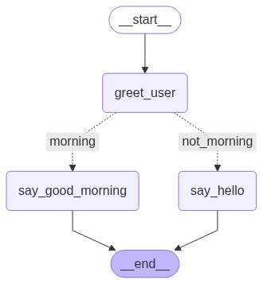

# LangGraph 개요

- 복잡한 워크플로우(에이전트, 다단계 문서 처리 등)를 그래프 형태로 모델링할 수 있음
- 그래프의 노드와 엣지 단위로 데이터 흐름을 시각적이고 구조적으로 표현 가능함
- LangChain과 함께 사용해 체인 기반 처리와 그래프 기반 로직을 병행할 수 있음
- LangChain의 직렬 구조보다 분기, 병합, 루프 등 복잡한 로직을 더 유연하게 구현 가능함
- 노드/엣지 단위 모듈화로 재사용성과 확장성이 높음
- 그래프 시각화 도구와 연동해 전체 흐름을 직관적으로 디버깅할 수 있음

---

## 1. 핵심 구성 요소

**State**
- 앱 전체에서 공유되는 데이터 스냅샷을 나타내는 구조임
- 일반적으로 `TypedDict` 또는 Pydantic의 `BaseModel` 형태로 정의함
- 각 노드 실행 결과로 상태가 덮어쓰기(override) 되어 업데이트됨
- 상태 기반으로 데이터 흐름을 체계적으로 제어할 수 있음

**Nodes**
- 에이전트의 개별 행동 단위로, 주어진 상태를 입력받아 처리함
- 내부적으로 함수 또는 연산 로직을 실행하고, 새로운 상태값을 반환함
- 하나의 노드는 하나의 작업(task)를 수행함
- 각 노드는 다른 노드와 연결되어 데이터 흐름을 형성함

**Edges**
- 현재 상태를 따라 다음에 실행할 노드를 결정함
- 조건 분기 로직이 포함될 수 있음
- 노드 간의 실행 순서를 제어하며, LangGraph의 흐름을 결정함

---

## 2. Graph 작성

### 1\) Graph 생성

**StateGraph**
- 상태 기반 그래프 구조를 정의하는 핵심 클래스임
- 대화나 처리 흐름을 `START` → `END` 구조로 체계적으로 구성함
- 노드 간 전환은 엣지를 통해 정의하며, 복잡한 조건 분기도 처리 가능함

**add_node**
- 그래프에 새로운 노드(작업 단위)를 추가하는 메소드임
- 각 노드는 독립적인 함수를 실행하며, 상태를 입력받아 결과를 반환함

**add_edge**
- 두 노드 간의 직접적인 실행 순서(연결 관계)를 정의하는 메소드임
- 한 노드의 실행이 끝난 후 다음 노드로 흐름을 이동시킴

**add_conditional_edges**
- 특정 조건에 따라 다음 노드를 동적으로 선택하는 분기 로직을 정의하는 메소드임
- 상태 값 또는 함수 변환값에 따라 흐름이 달라질 수 있음

```python
from langgraph.graph import StateGraph, START, END
from typing import TypedDict, Literal
from IPython.display import Image, display

# 1. 상태 정의
class MyState(TypedDict):
    name: str
    is_morning: bool

# 2. 노드 함수 정의
def greet_user(state: MyState) -> MyState:
    print(f"Hi, {state['name']}!")
    return state

def say_good_morning(state: MyState) -> MyState:
    print("Good morning!")
    return state

def say_hello(state: MyState) -> MyState:
    print("Hello!")
    return state

# 3. 조건 함수 정의
def is_morning(state: MyState) -> Literal["morning", "not_morning"]:
    return "morning" if state["is_morning"] else "not_morning"

# 4. 그래프 구성
builder = StateGraph(MyState)

builder.add_node("greet_user", greet_user)
builder.add_node("say_good_morning", say_good_morning)
builder.add_node("say_hello", say_hello)

builder.add_edge(START, "greet_user")
builder.add_conditional_edges(
    "greet_user",
    is_morning,
    {
        "morning": "say_good_morning",
        "not_morning": "say_hello",
    },
)
builder.add_edge("say_good_morning", END)
builder.add_edge("say_hello", END)

# 5. 그래프 컴파일
graph = builder.compile()

# 6. 그래프 시각화
display(Image(graph.get_graph().draw_mermaid_png()))
```



### 2\) Graph 실행

**invoke**
- 그래프를 한 번 실행하여 최종 결과 상태를 반환함

```python
graph.invoke({"name": "Bob", "is_morning": True})

"""
Hi, Bob!
Good morning!
{'name': 'Bob', 'is_morning': True}
"""
```

**stream**
- 그래프 실행 과정을 스트리밍 형태로 순차 출력함

- `stream_mode="values"`
    - 상태 값의 변경 내역만 출력함
    - 각 노드 실행 이후의 상태를 확인할 수 있음

```python
for step in graph.stream({"name": "Bob", "is_morning": False}, stream_mode="values"):
    print(step)
    print("---"*10)

"""
{'name': 'Bob', 'is_morning': False}
------------------------------
Hi, Bob!
{'name': 'Bob', 'is_morning': False}
------------------------------
Hello!
{'name': 'Bob', 'is_morning': False}
------------------------------
"""
```

- `stream_mode="updates"`
    - 어떤 노드가 어떤 값을 업데이트했는지까지 출력됨
    - 상태 변환뿐 아니아 노드별 실해우 결과 추적이 가능하여 디버깅용으로 사용할 수 있음

```python
for step in graph.stream({"name": "Bob", "is_morning": False}, stream_mode="updates"):
    print(step)
    print("---"*10)

"""
Hi, Bob!
{'greet_user': {'name': 'Bob', 'is_morning': False}}
------------------------------
Hello!
{'say_hello': {'name': 'Bob', 'is_morning': False}}
------------------------------
"""
```

---

## 3. Graph 고급 기능

### 1\) Command

- LangGraph 핵심 제어 도구로, 노드 함수의 반환값으로 사용됨
- 상태 업데이트와 다음 노드 지정이라는 두 가지 역할을 동시에 수행할 수 있음
- 복잡한 흐름 제어나 정보 전달이 필요한 상황에서 유용함
- 그래프 실행 중 동적으로 상태를 수정하거나 분기를 제어할 수 있음

> **`Command` vs `add_conditional_edges`**
> - `Command`는 노드 내부에서 상태를 업데이트하면서 다음 노드를 지정할 수 있음
> - `add_conditional_edged`는 상태 변경 없이 조건에 따라 정적으로 분기만 처리함
> - 복잡한 전이와 상태 변경이 필요한 경우 `Command`가 적합함
> - 단순한 조건 분기만 필요한 경우 `add_conditional_edges` 사용이 효율적임

### 2\) Reducer

- `Reducer`는 상태 업데이트 방식의 핵심 메커니즘임
- 기본 동작은 각 노드의 반환값이 해당 키의 기존 값을 덮어쓰는 방식(override)으로 작동함
- 따라서 상태 값을 누적하거나 병합해야 하는 경우, `Reducer`를 명시적으로 등록해야 함
- 리스트에 항목을 계속 추가하거나, 딕셔너리를 병합할 때 사용함
- `operator.add`를 사용해 기존 리스트에 새 메시지를 추가할 수 있음
- `langgraph.graph.message.add_messages`를 사용하면 메시지 객체 리스트를 효율적으로 관리할 수 있음
    - 메시지 ID 기반으로 기존 메시지를 업데이트하거나 중복 없이 추가하는 고급 제어가 가능함
    - 새 메시지는 기존 목록에 추가하고, 기존 메시지는 적절히 처리함
- 더 복잡한 상태 관리가 필요한 경우, `Reducer`를 사용자 정의하여 적용할 수 있음

```python
from langgraph.graph import StateGraph, START, END
from langgraph.types import Command
from langgraph.graph.message import add_messages
from langchain_core.messages import HumanMessage, SystemMessage, AIMessage, AnyMessage
from langchain_google_genai import ChatGoogleGenerativeAI
from typing import TypedDict, Annotated
from pydantic import BaseModel, Field

# 시스템 프롬프트 정의
SUMMARY_PROMPT = "You are a helpful assistant that summarizes the following text."
EVALUATE_PROMPT = "You are a helpful assistant that evaluates the quality of a summary.\n" \
                  "You must provide a quality score between 0.0 and 1.0, where 0.0 is the lowest quality and 1.0 is the highest quality."
IMPROVE_PROMPT = "You are a helpful assistant that enhances low-quality summaries generated by AI.\n" \
                 "Your goal is to rewrite them to be clearer, more accurate, and more natural."

# 출력 구조화
class Summary(BaseModel):
    summary: Annotated[str, Field(description="The summary of the text")]

class Evaluation(BaseModel):
    quality: Annotated[float, Field(description="The quality of the summary", ge=0, le=1)]

# 모델 정의
llm = ChatGoogleGenerativeAI(
    model="gemini-2.0-flash",
    temperature=0.5
)

# 상태 정의
class SummaryState(TypedDict):
    text: str
    summary: str
    quality: float
    finalized: bool
    iteration: int
    messages: Annotated[list[AnyMessage], add_messages]

# 1. 요약 노드
def summarize_text(state: SummaryState) -> Command:
    messages = [
        SystemMessage(content=SUMMARY_PROMPT),
        HumanMessage(content=f"Please summarize the following text: {state['text']}\n\nSummary:")
    ]
    response = llm.with_structured_output(Summary).invoke(messages)

    print(f"[summarize_text] 요약 완료")
    return Command(
        goto="evaluate_summary",
        update={
            "summary": response.summary, 
            "iteration": 0,
            "messages": messages + [AIMessage(content=response.summary)]
        }
    )

# 2. 품질 평가 노드
def evaluate_summary(state: SummaryState) -> Command:
    messages = [
        SystemMessage(content=EVALUATE_PROMPT),
        HumanMessage(content=f"The text is: {state['text']}\n\nPlease evaluate the following summary: {state['summary']}")
    ]
    response = llm.with_structured_output(Evaluation).invoke(messages)

    print(f"[evaluate_summary] 평가 결과: {response.quality}")

    # 품질에 따라 다음 노드 분기 및 상태 업데이트
    return Command(
        goto="finalize_summary" if response.quality > 0.8 or state["iteration"] > 3 else "improve_summary",
        update={
            "quality": response.quality, 
            "messages": messages + [AIMessage(content=str(response.quality))]
        }
    )

# 3. 개선 노드
def improve_summary(state: SummaryState) -> Command:
    messages = [
        SystemMessage(content=IMPROVE_PROMPT),
        HumanMessage(content=f"The text is: {state['text']}\n\n"
                             f"Please enhance the following summary: {state['summary']}\n\nEnhanced Summary:")
    ]
    response = llm.with_structured_output(Summary).invoke(messages)

    print(f"[improve_summary] 요약 수정됨")
    return Command(
        goto="evaluate_summary",
        update={
            "summary": response.summary, 
            "iteration": state["iteration"] + 1,
            "messages": messages + [AIMessage(content=response.summary)]
        }
    )

# 4. 최종화 노드
def finalize_summary(state: SummaryState) -> Command:
    print(f"[finalize_summary] 최종 요약 완료")
    return Command(
        goto=END,
        update={"finalized": True}
    )

# 그래프 생성
builder = StateGraph(SummaryState)

builder.add_node("summarize_text", summarize_text)
builder.add_node("evaluate_summary", evaluate_summary)
builder.add_node("improve_summary", improve_summary)
builder.add_node("finalize_summary", finalize_summary)

builder.add_edge(START, "summarize_text")

graph = builder.compile()

# 테스트 케이스
text = """
The app is useful. I use it every day. Some features are hard to find. But I still use it. It’s okay.
"""
for step in graph.stream({"text": text}, stream_mode="updates"):
    print(step)
    print("---"*10)

"""
[summarize_text] 요약 완료
{'summarize_text': {'summary': 'The app is useful and used daily, but some features are hard to find. Overall, the user thinks it is okay.', 'iteration': 0, 'messages': [SystemMessage(content='You are a helpful assistant that summarizes the following text.', additional_kwargs={}, response_metadata={}, id='63b10c5f-823c-4f08-86b4-210dc9b51fdc'), HumanMessage(content='Please summarize the following text: \nThe app is useful. I use it every day. Some features are hard to find. But I still use it. It’s okay.\n\n\nSummary:', additional_kwargs={}, response_metadata={}, id='d2366232-8dc0-4909-80e9-0d433c6e60cc'), AIMessage(content='The app is useful and used daily, but some features are hard to find. Overall, the user thinks it is okay.', additional_kwargs={}, response_metadata={}, id='9262aba1-f46b-4d35-ab11-7dcc2a8829ae')]}}
------------------------------
Task finalize_summary with path ('__pregel_pull', 'finalize_summary') wrote to unknown channel branch:to:__end__, ignoring it.
[evaluate_summary] 평가 결과: 0.9
{'evaluate_summary': {'quality': 0.9, 'messages': [SystemMessage(content='You are a helpful assistant that evaluates the quality of a summary.\nYou must provide a quality score between 0.0 and 1.0, where 0.0 is the lowest quality and 1.0 is the highest quality.', additional_kwargs={}, response_metadata={}, id='9604eba9-f6ec-4991-88d0-59ceed797c56'), HumanMessage(content='The text is: \nThe app is useful. I use it every day. Some features are hard to find. But I still use it. It’s okay.\n\n\nPlease evaluate the following summary: The app is useful and used daily, but some features are hard to find. Overall, the user thinks it is okay.', additional_kwargs={}, response_metadata={}, id='62d012bd-331a-4176-8c4d-47a28d7db643'), AIMessage(content='0.9', additional_kwargs={}, response_metadata={}, id='5cf81ecc-6a42-41d4-8b23-09c5bb6b2981')]}}
------------------------------
[finalize_summary] 최종 요약 완료
{'finalize_summary': {'finalized': True}}
------------------------------
"""
```

### 3\) MessagesState

- LangGraph는 메시지 목록 기반의 채팅 모델 인터페이스를 사용함
- 대화 기록은 그래프 상태 내에 메시지 객체 리스트 형태로 저장되며, 이를 통해 효율적인 대화 관리가 가능함
- `MessagesState`는 메시지 관리를 위해 미리 정의된 상태 타입으로, `add_messages` 리듀서를 기본으로 사용하여 메시지 업데이트를 자동으로 처리함
- `MessagesState`를 상속하여 새로운 상태 타입을 정의할 수 있음

### 4\) Send

- 동적으로 엣지를 생성하고, 각기 다른 상태를 병렬로 전달할 수 있는 메커니즘임
- 상태 분기 및 분산 처리를 위한 핵심 기능이며, 특히 Map-Reduce 패턴에 활용됨
- 하나의 상태를 여러 하위 작업에 분배하고, 각 작업 결과를 다시 모아 처리하는 구조로 구현 가능함
- 데이터 샤딩, 병렬 작업, 결과 통합 등 대규모 작업 분산 처리에 적합함

**Map-Reduce 패턴**
- 대규모 데이터를 처리할 때 흔히 사용하는 분산 처리 방식임
- `Send` 객체를 사용하여 Map 단계를 구현할 수 있음
- Map 단계는 하나의 노드를 여러 개의 작업으로 분할함
- Reduce 단계는 각 병렬 노드의 실행 결과를 결합함

```python
from langgraph.graph import StateGraph, START, END
from langgraph.types import Send
from langchain_core.documents import Document
from typing import TypedDict, List, Annotated
from operator import add
from pprint import pprint

# 전체 상태 정의
class OverallState(TypedDict):
    docs: List[Document]
    summaries: Annotated[List[str], add]

# 로컬 상태 정의
class DocState(TypedDict):
    doc: Document

# 라우터 함수
def map_router(state: OverallState) -> List[Send]:
    return [Send("map_node", {"doc": doc}) for doc in state["docs"]]

# 맵 노드 함수
def map_node(state: DocState) -> OverallState:
    doc = state["doc"]
    summary = f"{doc.metadata['source']}: {doc.page_content[:30]}..."
    return {"summaries": [summary]}

# 그래프 생성
builder = StateGraph(OverallState)

builder.add_node("map_node", map_node)
builder.add_conditional_edges(START, map_router, ["map_node"])
builder.add_edge("map_node", END)

graph = builder.compile()

# 테스트
docs = [
    Document(page_content="LangChain is a framework for building LLM-powered apps.", metadata={"source": "intro"}),
    Document(page_content="StateGraph enables structured workflows with shared state.", metadata={"source": "graph"}),
    Document(page_content="Send can dynamically route data to other nodes.", metadata={"source": "send"}),
]
result = graph.invoke({"docs": docs})
pprint(result)

"""
{'docs': [Document(metadata={'source': 'intro'}, page_content='LangChain is a framework for building LLM-powered apps.'),
          Document(metadata={'source': 'graph'}, page_content='StateGraph enables structured workflows with shared state.'),
          Document(metadata={'source': 'send'}, page_content='Send can dynamically route data to other nodes.')],
 'summaries': ['intro: LangChain is a framework for b...',
               'graph: StateGraph enables structured ...',
               'send: Send can dynamically route dat...']}
"""
```

---

## Reference

- 🔗 [Graph API 개념](https://langchain-ai.github.io/langgraph/concepts/low_level/) / [Functional API](https://langchain-ai.github.io/langgraph/concepts/functional_api/) / [LangGraph Studio](https://langchain-ai.github.io/langgraph/concepts/langgraph_studio/)